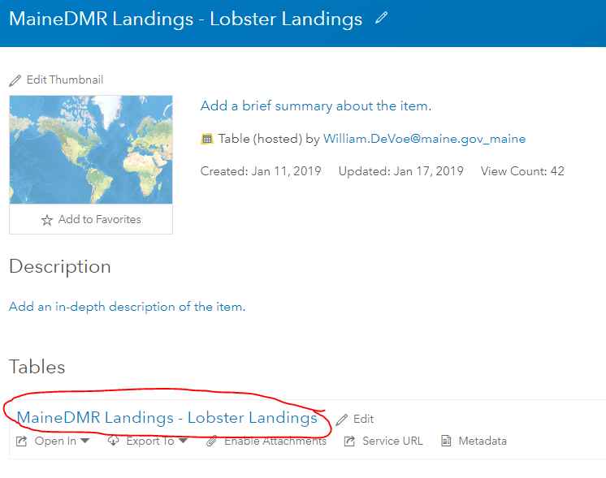

# Using ArcGIS Online Data in R

### Bill DeVoe, MaineDMR GIS Coordinator, <a href="mailto:William.DeVoe@maine.gov" class="email">William.DeVoe@maine.gov</a>

Pulling data from an item’s Open Data page
------------------------------------------

Using the example of lobster zones - under the Download button is a link
for a ShapeFile. Under the API link is a link to a GeoJSON. I find
GeoJSONs more useful. They avoid some of the issues with ShapeFiles,
particularly the 8 character limit on field names, which can be a
problem if an agency publishes data with field names like
`lobsters_number_caught` and `lobsters_number_released`, which when
converted to a ShapeFile will become `LOBSTE_1` and `LOBSTE_2`.

Grabbing the link to the GeoJSON, this can be converted to an SP object
using the `geojsonio` package.

``` r
library(geojsonio) 
```

    ## 
    ## Attaching package: 'geojsonio'

    ## The following object is masked from 'package:base':
    ## 
    ##     pretty

``` r
library(sp)

# URL to query for GeoJSON
url <- "https://opendata.arcgis.com/datasets/55a305a17acd46f58675d955e4fcaa83_0.geojson"
# Read GeoJSON as spatial dataframe
zones <- geojsonio::geojson_read(url, what="sp")
# Columns have full names
names(zones)
```

    ## [1] "OBJECTID"         "ZONEID"           "created_user"    
    ## [4] "created_date"     "last_edited_user" "last_edited_date"

``` r
# Take a look
sp::spplot(zones)
```


Scraping data from an AGOL or ArcServer Service
-----------------------------------------------

Many agencies publish data to AGOL or host data from an ArcServer
deployment, but do not share the data with an Open Data portal. This
data can be acquired from the REST endpoint of the service, which is
under URL on an AGOL item’s page.

### For simple services

For services with less features than the query limit, a link for a
GeoJSON can be generated with the query engine and used with the code
chunk above.

To generate the URL:

1.  On the item’s page, click the layer within the item.



1.  The service endpoint page for the item will appear. Make note of the
    `Max Record Count`.


1.  Scroll to the bottom and select `Query`.
    

2.  On the query page, for the `Where` field enter `1=1`.

3.  Set `Return Count Only` to `True` and click `Query (GET)`. The
    number of records in the dataset will be returned. If this number is
    higher than the number observed for the service’s
    `Max Record Count`, you will need to use the method in the next
    section.


1.  If the record count is acceptable, set `Return Count Only` to
    `False` and change `Format` to `GeoJSON`. Then click `Query (GET)`.


1.  The resulting page should look similar to this - what you are
    looking at is a parsed JSON of the query submitted.


1.  Copy the URL of this page from the browser navigation bar. For this
    example, the URL is:

`https://services1.arcgis.com/RbMX0mRVOFNTdLzd/arcgis/rest/services/MaineDMR_Lobster_Landings/FeatureServer/0/query?where=1%3D1&objectIds=&time=&resultType=none&outFields=*&returnHiddenFields=false&returnIdsOnly=false&returnUniqueIdsOnly=false&returnCountOnly=false&returnDistinctValues=false&orderByFields=&groupByFieldsForStatistics=&outStatistics=&having=&resultOffset=&resultRecordCount=&sqlFormat=none&f=pjson&token=9wqzi8hNagsvO4QgwXFb_Du_i2_9rtkJD2flRW_hk93IySjDwimfjeG9VeyarRhvDfIVeqKGPOgMqw6l81bfpdMkdSpajg6HRuuPcBPagbKVh6bA3kWkJnqmR09-DoWs5qyH8IOadWlinyRj5dMFUkMjUHQM2jJy-VW44-umvUTfTDG5dxZIL3DjglHfcyBTlcWO5xiKhDM8wt8hIDhetHTS4ZNplveO7VaEUfE_Ovk1CLr9RqFPzfv9IYaRL5YRtIuTak4Mpk8YOYL20DV72g..`

1.  Remove the token on the end of the URL so that the end of the URL is
    `&f=pjson`. The final query URL in this example would be this:

`https://services1.arcgis.com/RbMX0mRVOFNTdLzd/arcgis/rest/services/MaineDMR_Lobster_Landings/FeatureServer/0/query?where=1%3D1&objectIds=&time=&resultType=none&outFields=*&returnHiddenFields=false&returnIdsOnly=false&returnUniqueIdsOnly=false&returnCountOnly=false&returnDistinctValues=false&orderByFields=&groupByFieldsForStatistics=&outStatistics=&having=&resultOffset=&resultRecordCount=&sqlFormat=none&f=pjson`

1.  Use this URL in the code chunk above to pull in the GeoJSON.

### For services with more features than the query limit

The package `esri2sf` available at <https://github.com/yonghah/esri2sf>
will iterate over the query limit to convert an ArcGIS Online service to
an SF object. Full documentation is included on the package’s GitHub
page.
